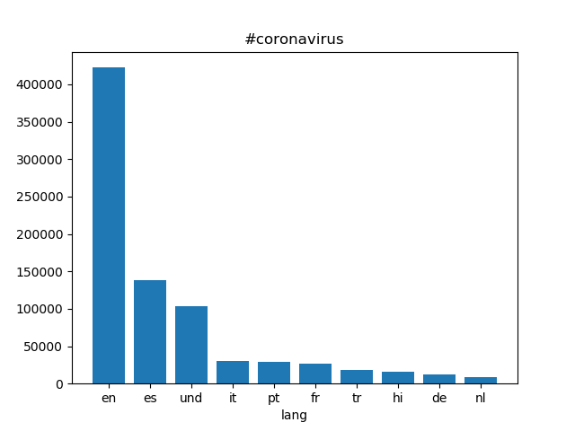
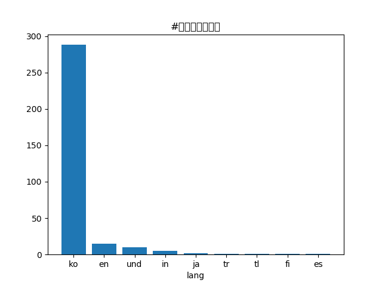
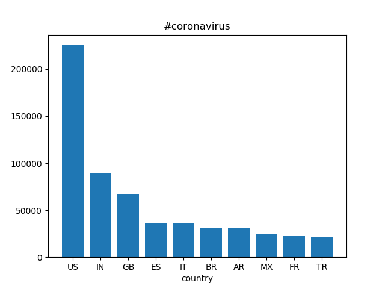
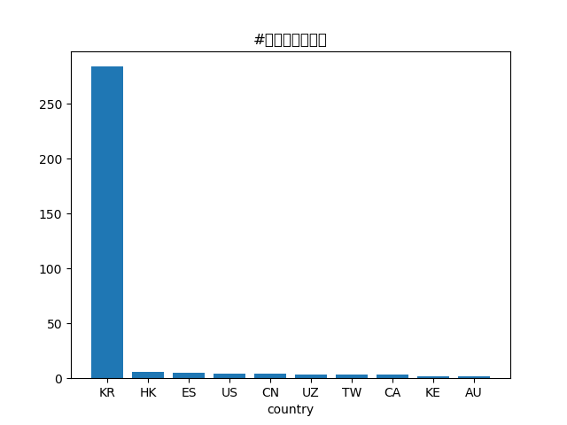

# Coronavirus twitter analysis

This project's purpose is to show the spread of the coronavirus on social media in 2020. It contains code used to scan all geotagged tweets sent in 2020 using the MapReduce divide-and-conquer paradigm to process the data in parallel.

## Background

The dataset that was scanned consists of about 1.1 billion geotagged tweets, which is around 2% of the total tweets sent in 2020.

## Methodology

The dataset was first split up into 365 files, each containing the all the tweets from one day in the year. A python script (`src/map.py`) was used to process the tweets from a single day. The number of times various hashtags related to coronavirus appeared in tweets were counted and grouped by language and country. A bash script was used to parallelize the counting by spawning a process in the background for each day's tweets. The resulting counts were stored in intermediate files (`outputs/*`), one for each day. More python scripts (`src/reduce.py`, `src/alternative_reduce.py`, `src/visualize.py`) were used to compile all of the counts in order to obtain statistics for the whole year and plot the results.

## Results

The following 4 plots show the number of times that the hastags `#coronavirus` and `#코로나바이러스` were used, grouped by the tweet's language and country of origin.

The following plot shows the number of times various hashtags were used on each day of 2020.

